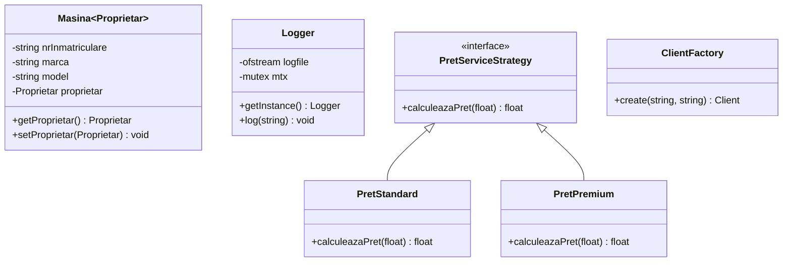

# Proiect3-POO

<h5>Autor: Plesca Maria-Erika, grupa 133</h5>

## <h2>Introducere</h2>
Acest proiect reprezintă un sistem complet de gestionare a unui service auto, care include:
- Gestionarea clienților și mașinilor
- Crearea și administrarea facturilor
- Managementul reparațiilor și serviciilor
- Rapoarte financiare și de stare

## <h2> ✅Implementarea Clasei Șablon: `Masina`</h2>


Clasa originală `Masina` era rigidă, putând stoca doar proprietari de tip `Client`. Prin transformarea ei într-un șablon, am obținut o **flexibilitate sporită** și o **reutilizare a codului**:

**Implementarea originală:**
```cpp
class Masina {
    // ...
    Client m_proprietar; // Tip fix
};
```

**Implementarea șablon:**
```cpp
template <typename Proprietar>
class Masina {
    // ...
    Proprietar proprietar; // Tip generic
};
```

### <h3>Beneficii:</h3>
1. **Abstracție crescută**: Putem folosi orice tip ca proprietar
2. **Extensibilitate**: Adăugarea de noi tipuri de proprietari fără modificări
3. **Specializare**: Comportament diferențiat pe tipuri
4. **Siguranță**: Verificări de tip la compilare

Exemple de utilizare:
```cpp
Masina<Client> masinaStandard; // Foloseste structura existenta
Masina<Angajat> masinaCompanie; // În cazul în care mașina aparține unui angajat.
```

## <h2> ✅ Atribut dependent de tipul Șablon</h2>
Am adăugat un atribut generic `Proprietar` care depinde de parametrul template:

```cpp
template <typename Proprietar>
class Masina {
    // ...
    Proprietar proprietar; //  Atribut dependent de T
};
```

Acest atribut permite:
- Stocarea oricărui tip de proprietar
- Accesarea datelor proprietarului prin metode specifice

## <h2>✅ Funcție membră dependentă de tipul șablon</h2>
Am implementat metode care depind direct de tipul template:

```cpp
Proprietar getProprietar() const { 
    return proprietar;
}

void setProprietar(const Proprietar& proprietar) { 
    this->proprietar = proprietar;
}
```

Aceste metode:
- Asigură acces controlat la atributul generic
- Permit manipularea proprietarului independent de tip

## <h2>✅ Implementare de funcții libere șablon (Friend)</h2>
Am adăugat funcții template prietene pentru Citire/Afișare și operații specifice:

### <h3>Operator de citire/Afișare</h3>
```cpp
template <typename P>
friend std::istream& operator>>(std::istream& is, Masina<P>& masina);

template <typename P>
friend std::ostream& operator<<(std::ostream& os, const Masina<P>& masina);
```

### <h3>Funcție specializată pentru afișare</h3>
```cpp
template <typename P>
friend void afiseazaMarca(const Masina<P>& masina) {
    std::cout << "Marca masinii este: " << masina.marca << std::endl;
}
```

## <h2>✅ 3 Design Patterns implementate</h2>

### <h3>1. Factory Pattern (Pattern de creare)</h3>
**Implementare:** `ClientFactory` și `MasinaClientFactory`

```cpp
class ClientFactory {
public:
    static Client create(const std::string& nume, const std::string& tip) {
        return Client(nume, tip);
    }
};

class MasinaClientFactory {
public:
    static Masina<Client> create(const std::string& nrInm, 
                                const std::string& marca,
                                const std::string& model,
                                const Client& proprietar) {
        return Masina<Client>(nrInm, marca, model, proprietar);
    }
};
```

**Înainte** așa citeam datele de tip Client 
```cpp
if (OPTIUNE == 1)
			{
				// Citirea unui nou client
				Client client;
				fin >> client;
				listaClienti.push_back(client);
			}
```
**După implementare `ClientFactory`**
```cpp
std::string nume, tipClient;
				Client client = ClientFactory::create(nume, tipClient);
				listaClienti.push_back(client);
```
<br>

**Înainte** așa citeam datele de tip Masina 
```cpp
Masina masina;
				fin >> masina;
				listaMasini.push_back(masina);
```
**După implementare `ClientFactory`**
```cpp
std::string nume, tipClient, nr, marca, model;
				std::cin >> nume >> tipClient;
				Client client = ClientFactory::create(nume, tipClient);

				std::cin >> nr >> marca >> model;
				Masina<Client> masina = MasinaClientFactory::create(nr, marca, model, client);

				listaMasini.push_back(masina);
```

**Beneficii:**
- Încapsulează logica de creare a obiectelor
- Simplifică adăugarea de noi tipuri de obiecte

### <h3>2. Strategy Pattern (Behavioral)</h3>
**Implementare:** `PretServiceStrategy` și implementări

```cpp
class PretServiceStrategy {
public:
    virtual float calculeazaPret(float costBaza) const = 0;
};

class PretStandard : public PretServiceStrategy {
public:
    float calculeazaPret(float costBaza) const override {
        return costBaza * 1.2f; // +20% markup
    }
};

class PretPremium : public PretServiceStrategy {
public:
    float calculeazaPret(float costBaza) const override {
        return costBaza * 1.1f; // +10% markup (discount pentru premium)
    }
};
```

**Beneficii:**
- Permite schimbarea dinamică a strategiilor de preț
- Încapsulează algoritmii de calcul
- Ușurează adăugarea de noi politici de preț

### <h3>3. Singleton Pattern (Creational)</h3>
**Implementare:** `Logger` pentru înregistrarea activităților

```cpp
class Logger {
public:
    static Logger& getInstance() {
        static Logger instance;
        return instance;
    }

    void log(const std::string& message) {
        std::lock_guard<std::mutex> lock(mtx);
        logfile << message << std::endl;
    }
    
    // Eliminăm copierea
    Logger(const Logger&) = delete;
    Logger& operator=(const Logger&) = delete;

private:
    Logger() : logfile("log.txt", std::ios_base::app) {}
    ~Logger() { if (logfile.is_open()) logfile.close(); }

    std::ofstream logfile;
    std::mutex mtx;
};
```

**Beneficii:**
- Acces global la un singur punct de logging
- Asigură consistența fișierului de log
- Previne concurența cu mutex
- Simplifică gestionarea resurselor


